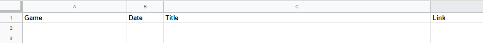
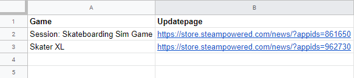

## About
A scraper that keeps track of new updates for your steam games and inserts them into Google Sheets.

## Start
`python run.py`

1. Scrape all: This will scrape the updates of the games listed in sheet 2 of your Google sheets document, see section 'Google sheets'
2. Get games list: This will get all the games from sheet 2 in Google sheets along with date of latest update
3. Start autoscraper: This will start a task to scrape updates every 30 seconds

## Google API Key
Setup a Google Developer Project and add Google Sheets and Google Drive API's.
https://developers.google.com/sheets/api/guides/authorizing

Then download the credentials.json and place in your project root.

## Google sheets
In your Google drive, create a document called "Game updates" with two sheets. Share this with "client_email" from credentials.json

First sheet: 

Second sheet: 
 
Contains the games you want to watch. The update page is the update page for the game, this is needed by the scraper.

## Required libraries

requests 
beautifulsoup4 
gspread 
oauth2client 
